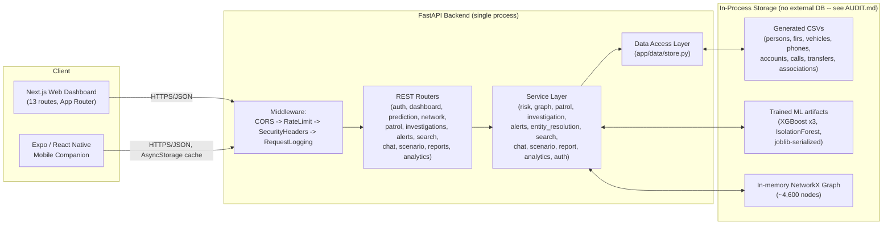
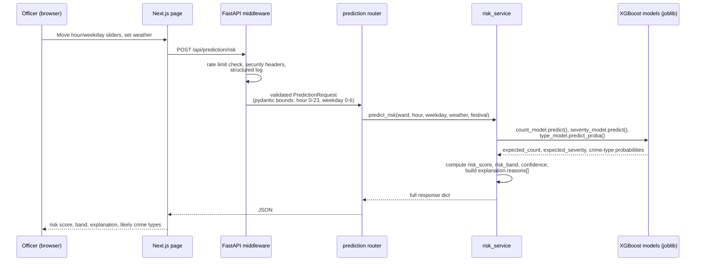
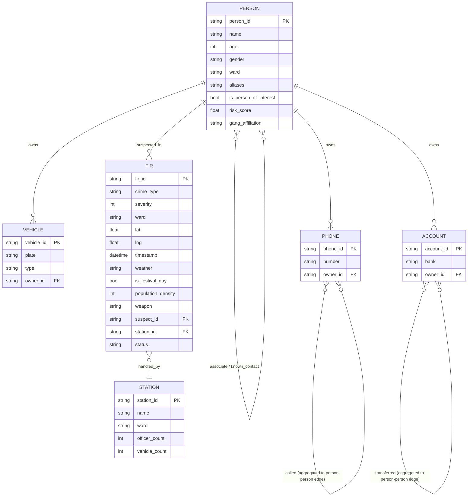

# CrimeGraph AI -- Architecture & Data Model

This document was missing entirely in earlier passes of this build (flagged as
a real gap in the checklist audit). It covers system architecture and the
data model actually implemented -- not an aspirational target architecture.

## System architecture

**Why no Postgres/Redis/Neo4j box in this diagram:** this prototype deliberately
runs as a single FastAPI process with in-memory pandas DataFrames and a
NetworkX graph, generated fresh (deterministically, via a fixed seed) on
first boot. See `AUDIT.md` for the reasoning and the swap-in points
(`app/data/store.py` for a real database, `app/services/graph_service.py`
for Neo4j) if this were to become a real multi-user deployment.

## Request flow (example: a prediction request)

## Data model (entity relationships)

This is the schema actually generated by `app/data/synthetic_generator.py` and
loaded by `app/data/store.py` -- not a target schema for a future database.
If this became a real Postgres deployment, each table above maps directly to
a Postgres table with the same columns; `PERSON`-to-`PERSON` edges (calls,
transfers, associations) would become either a join table or, more naturally,
live in a graph database (Neo4j) alongside the rest of the relationship graph.
